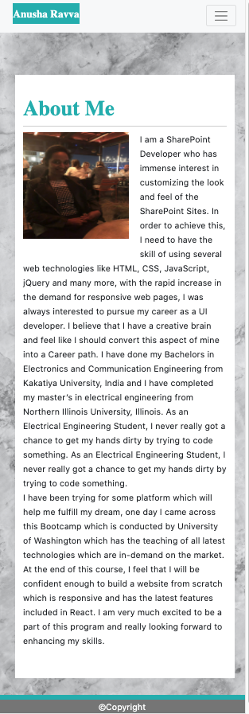
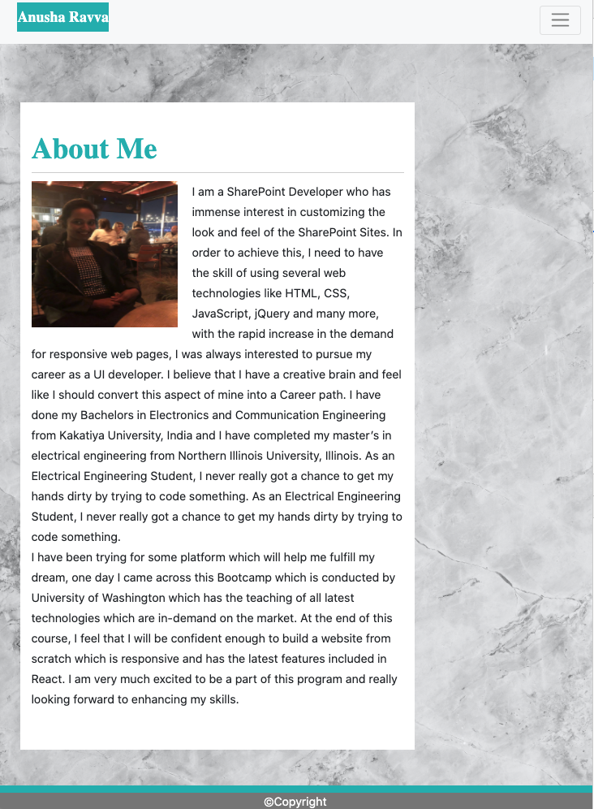

# HOMEWORK ASSIGNMENT 2 : RESPONSIVE PORTFOLIO

You can view the project page at -> [Project Page]()

## Table of Contents

* [Project Whereabouts](#project-whereabouts)
* [About Me Page](#aboutme-page)
   *[About Me xs-screen](#aboutme-xs-screen)
   *[About Me sm-screen](#aboutme-sm-screen)
   *[About Me md-screen](#aboutme-md-screen)
* [Portfolio Page](#portfolio-page)
   *[Portfolio xs-screen](#portfolio-xs-screen)
   *[Portfolio sm-screen](#portfolio-sm-screen)
   *[Portfolio md-screen](#portfolio-md-screen)
* [Contact Me Page](#contactme-page)
   *[Contact Me xs-screen](#contactme-xs-screen)
   *[Contact Me sm-screen](#contactme-sm-screen)
   *[Contact Me md-screen](contactme-md-screen)
* [Installation](installation)
* [Project Page] (Project Page)

## Project Wherebabouts

The Main adgenda of this project is to start creating a responsive portfolio, which will be used as an interaction to the external users where they can communicate with us eventually, It will have a breif overview on past experience, It also has a portfolio page which has a photo gallery listing all the previous achievements and special events. The ultimate goal is to build all these pages using the capabilities and functionalities available in bootstrap library. It is also very important to build these pages using HTML semantics.
These three pages should have a responsive capability to adapt to the changes in the screen sizes. So we need to build this site in a such a way that it fits right in xs-screen (For Mobiles), for sm-screen (For Tablets) and for md-screen (Regular Desktops). Every html page has a Nav bar which has navigation links to all the other pages and the active link is turned to black on the navigation bar.

## About Me Page

This page has the brief overview of my career intrests and my future goals I would like to achieve, This page was built using Bootstrap Classes and used some custom styles to change the look and feel of the site. It has three different modes of display included in it.

### About Me xs-screen

Below is the screenshot attched for xs-400 of About Me Page, The About Me container would align in the centre and the nav bar is also collapsed into a toggle

### About Me sm-screen

The small screen is basically used for tablets and the navigation bar is collapsed to maintain consistency , neat look and feel

### About Me md-screen

The medium screen is basically used for by general desktops. The Navigation bar will display all the three different links

## Portfolio Page

This page has a list of pictures which shows my personality that I love to travel and like to live in the nature. I have been to Brazil during my Masters to attend a conference which was based out of photosensitive research.

### Contact Me xs-screen

Below is the screenshot attched for xs-400 of About Me Page, The About Me container would align in the centre and the nav bar is also collapsed into a toggle

### About Me sm-screen

The small screen is basically used for tablets and the navigation bar is collapsed to maintain consistency , neat look and feel

### About Me md-screen

The medium screen is basically used for by general desktops. The Navigation bar will display all the three different links, 

NOTE: I COULD NOT CAPTURE FEW SCREENSHOTS EXACTLY BECAUSE OF SOME TECHNICAL ISSUES IN MY MACHINE.

## Installation

Clone the Git repository using SSH Key from -> git@github.com:anurav18/ResponsivePortfolio.git

## Project Page

Project Link: [https://anurav18.github.io/ResponsivePortfolio/.](https://anurav18.github.io/ResponsivePortfolio/.)

